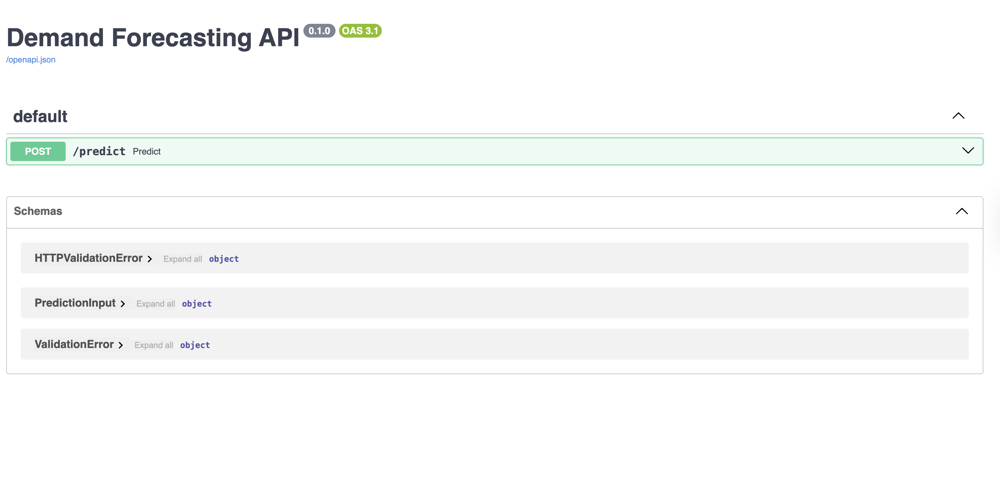
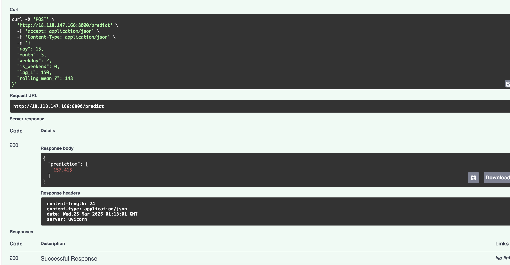

# 📊 Demand Forecasting System (ML + FastAPI + Cloud)

## 🚀 Live Demo

- 🌐 Render: https://demand-forecasting-ml-adet.onrender.com/docs  
- ☁️ AWS EC2: http://18.118.147.166:8000/docs  

📸 Screenshots

API Documentation (Swagger UI)

Prediction Example

🧠 Project Overview

This project predicts product demand using machine learning and time-series feature engineering.  
It exposes a real-time prediction API built with FastAPI and deployed on both Render and AWS EC2.

⚙️ Tech Stack

- Python
- Pandas, NumPy
- Scikit-learn (RandomForest)
- FastAPI
- AWS EC2
- Render
- Docker (optional)
  
Features

- Engineered time-series features:
  - Lag features (previous day sales)
  - Rolling averages (7-day mean)
- Machine Learning model for demand prediction
- REST API for real-time predictions
- Deployed on cloud (Render + AWS)
- Scalable and production-ready structure

## 🔌 API Usage
Endpoint: POST `/predict`

### Request Example:

{
  "day": 15,
  "month": 3,
  "weekday": 2,
  "is_weekend": 0,
  "lag_1": 150,
  "rolling_mean_7": 148
}
### Response:
{
  "predicted_sales": 158.26
}

☁️ Deployment

	•	Deployed on Render for quick access

	•	Deployed on AWS EC2 for production-level hosting
	
	•	Configured FastAPI server with public access

💼 Key Learnings
	•	Handling dependency issues in cloud environments
	•	Model optimization for low-resource machines
	•	End-to-end ML deployment pipeline
	•	Building and deploying REST APIs

📌 Future Improvements
	•	Add Streamlit dashboard for visualization
	•	Real-time streaming using Kafka
	•	Model monitoring and retraining pipeline
	•	Docker + Kubernetes deployment
👨‍💻 Author

Sai Satish
